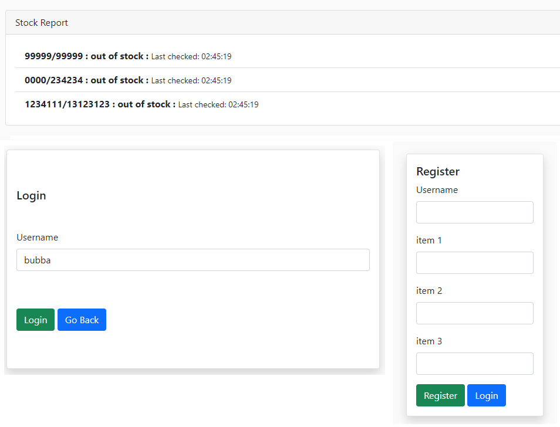
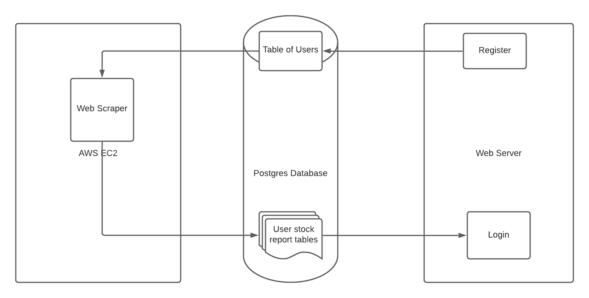
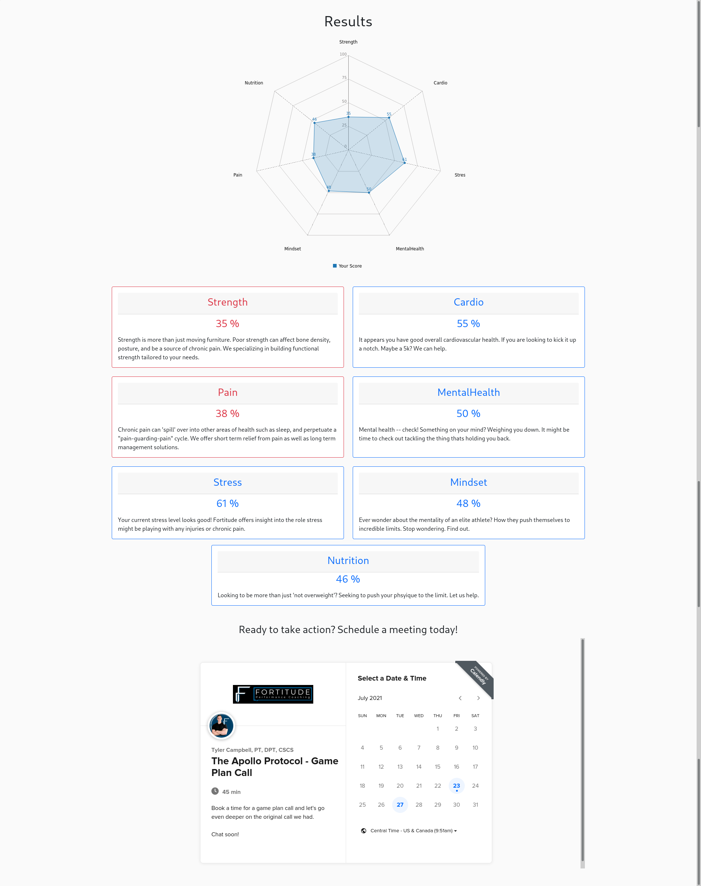
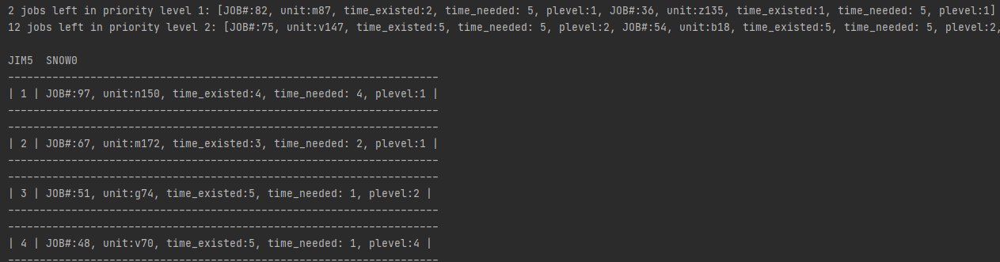
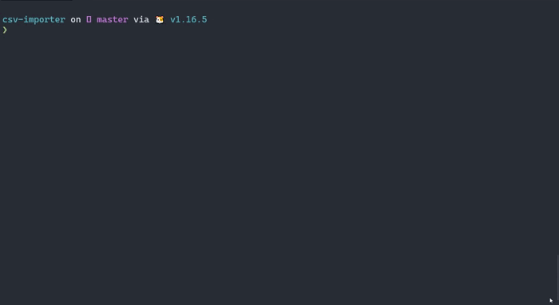
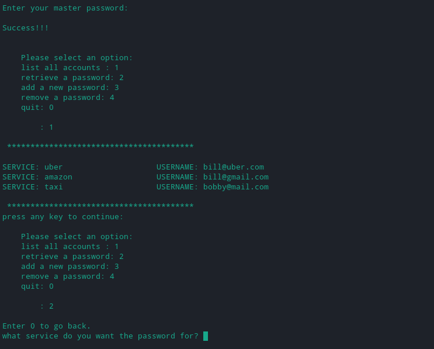
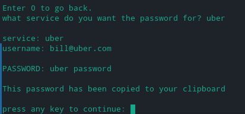
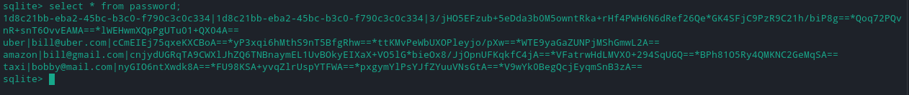
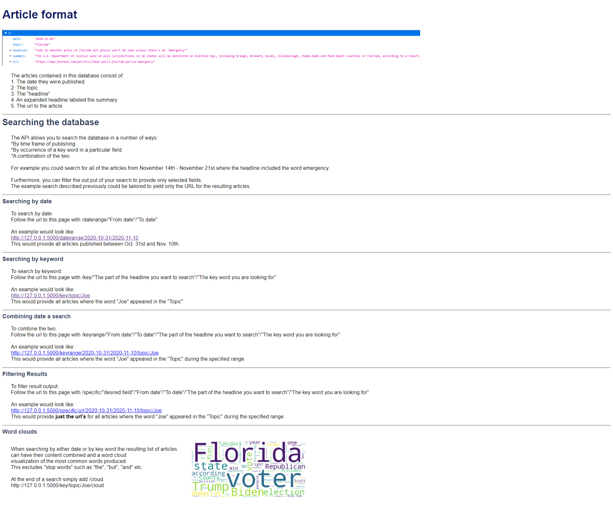

# [Project 1: Yikes!](https://still-wildwood-10638.herokuapp.com/)

## A yelp like website for sharing haunted locations!

#### [The github repo](https://github.com/wcstrickland/yikes)

A web app for users to:

- create locations listings
- leave reviews
- and report content

This project includes:

- NodeJS
- [Recursion](https://wcstrickland.github.io/Portfolio/)
- Express
- MongoDB
- Deployment via Heroku
- templating to create dynamic web pages
- user authentication
- using API's from multiple cloud services. e.g. mongoDB, cloudinary, mapbox

---

# [Project 2: Lego Checker](https://young-bastion-87475.herokuapp.com/)

## A website for checking on lego availability.

#### The github repos

[The web scraper](https://github.com/wcstrickland/lego)

[The web site](https://github.com/wcstrickland/legoweb)

A web app for users to:

Create a list of desired lego items and recieve hourly updates on if the item is in stock or not.

The web scraper runs on an AWS EC2 instance and reads 1/4 of the users' item lists from the database every 15 minutes and determines if the item is available or not. And then
updates the status of each item in a table dedicated to the user.

A Go web server running as a docker container on Heroku provides a site for creating
users and their desired items as well as checking on the status of said items.

This project includes:

- Python
- Go
- AWS
- Docker
- Selenium web scraping
- Postgres Database
- Basic MVC pattern
- Cron

---

# [Project 3: Call Center performance analysis and visualization](https://github.com/wcstrickland/call_center)

#### Business Case: A call center supervisor is provided an excel spreadsheet with performance metrics generated by call monitoring software and desires a format with improved insight.

Reformatted [original](images/call_raw_xl.png) excel workbook designed for rudimentary analysis.
Then used Python to reorganize data and calculate new fields specific to business case,
and generated [statistical analysis](images/jupyter_img.png) of performance by group.
Finally, exported data to tableau and created [interactive dashboard](https://public.tableau.com/shared/DXR4B5K7Y?:display_count=n&:origin=viz_share_link) for the end user.

---

# [Project 4: Apollo Protocol Questionnaire](https://pure-falls-67220.herokuapp.com/)

## A small node app meant to replace a google form and offer additional functionality.

#### [The github repo](https://github.com/wcstrickland/apollo)

A web site that:

- serves a form
- categorizes questions and weights questions appropriately
- and provides immediate custom feedback with category scores and a graph representation of results.
- automates email responses

This project includes:

- NodeJS
- Express
- 3rd party Graph library billboard JS
- automated email api
- Deployment via Heroku

---

# [Project 5: Priority Queue Scheduler](https://github.com/wcstrickland/priorityqueue)

## Concept

The program allows the creation of Employees, Jobs, and Priority levels. Jobs have several properties including a priority level, a length of time the job has been listed, and an estimated time the job will take to complete. The program assigns “jobs” to employees always allocating the highest priority level job that has been listed the longest. This system ensures the most important jobs are evenly distributed across employees for simultaneous completion to prevent bottlenecking. Employees are scheduled up until they reach their “max hours” for the day, which may vary if the employee is part-time or working a half-day. A threshold can be set to provide an alert if there are jobs left outstanding in a priority level after scheduling to determine resource management such as authorizing overtime or using temp employees.

## Practical Highlights:

- Versatile: can be applied to any allocation of a prioritized workflow (maintenance work orders, call center hold queue, patient intake in a hospital)
- Streamlined: user input required only at the level of necessity such as creating a work order or determining employees who are not working on a given day. Jobs are automatically added to appropriate queues, and warnings are provided if inputs are malformed such as creating a job with a priority level that does not exist.
- Reusable
- Efficient

## Technical Highlights:

- Use of unit testing
- Use of max heap to create priority queues based on the attribute of an object to optimize performance
- Use of generator functions.

## Sample alert and individual schedule

---

# Project 6: Create database table from CSV

#  [python version](https://github.com/wcstrickland/csv_to_sql)

#### A python command line tool that inserts data from a CSV file into a Database.

The goal of the project was to provide a tool to quickly migrate large amounts of data into a databse where the traditional import tools in database workbenches would become bogged down or hang. The sample file shown in the gif is a flow cytometry output CSV of over a million rows and almost 20 columns. The file is [too large](images/csv4.png) to upload to github and consistently causes the MySQL workbench import wizard to fail. Even after converting the CSV to a a SQL script the process is still unreliable. This program creates a database table and inserts the data in a matter of [seconds](images/csv1.png).

This project includes

- [creating a Command Line Interface](images/csv3.png)
- property decoration
- generator behavior
- context managers
- i/o
- custom iteration

## [version](http://github.com/wcstrickland/csv-importer)

#### A go command line tool for inserting csv files into a databse

The goal of this project was to improve upon my previous python version by providing: a cross-platform binary with no dependencies, support for multiple databases, improved flexibility with command line flags, and improved performance via go's static type system and concurrency tools.

This project includes:

- concurrency patterns such as worker pools, "fan out - fan in", and channels
- database connection management
- input validation

---

# [Project 7: Password manager](https://github.com/wcstrickland/password)

## A command line password manager written in Python.

The password manager includes:

- basic CRUD for passwords
- the ability to generate random passwords
- passwords are automatically copied to the clipboard when they are created or retrieved
- passwords are encrypted before being stored
- the master password is never stored

---

# Project 8: Rock Paper Scissors

# [Python version](https://github.com/wcstrickland/rock_paper_scissors)

# [Javascript version](https://github.com/wcstrickland/RockPaperScissors)

#### A simple graphical game of Rock Paper Scissors.

This project includes:

- implementing logic in multiple languages.
- drawing/manipulating GUI elements
- callback functions
- basic DOM manipulation

---

# [Project 9: Web Scraper and API](https://github.com/wcstrickland/news_api)

#### A REST API interfacing with a data base of news articles scraped from a website in JSON like format.

##### Part 1

Created a web scraping program that requests html from a major news outlet and then parses the request return via tags.

##### Part 2

Created a front facing API that allows users to programmatically search the data base with high level of specificity through a series of endpoints, or a simple query string.

##### Part 3

Created a simple static html page with a brief description of the API’s endpoints and provided examples on how to properly use them.

This project includes:

- web scraping to attain information not available via public API
- capturing information via python and storing/accessing it in a database.
- Web framework principles (Flask) specifically establishing request routes, defining resources, serialization of information to JSON format.
- Utilizing a python driver to interface with SQL.

